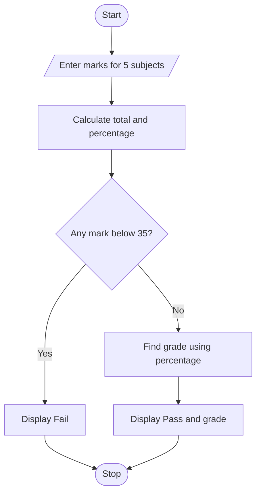

# Student Grade Calculator — Simple Flowchart

```mermaid
flowchart TD
 A([Start]) --> B[/Enter marks for 5 subjects/]
 B --> C[Calculate total and percentage]
 C --> D{Any mark below 35?}
 D -- Yes --> E[Display Fail]
 D -- No --> F[Find grade using percentage]
 F --> G[Display Pass and grade]
 E --> H([Stop])
 G --> H
```
