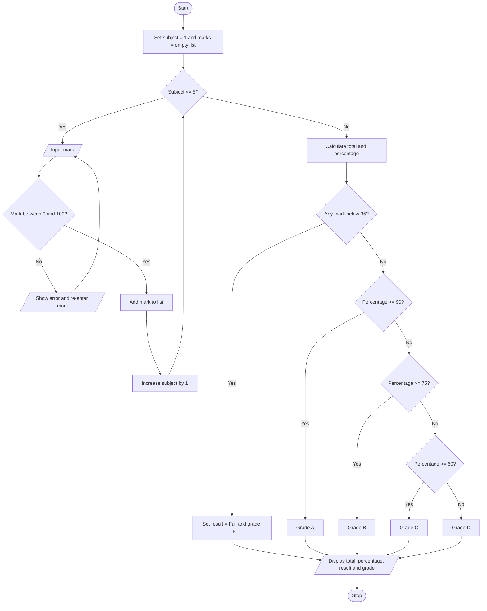

# Flowchart — Student Grade Calculator

```mermaid
flowchart TD
    A([Start]) --> B[Set subject = 1 and marks = empty list]
    B --> C{Subject <= 5?}
    C -- Yes --> D[/Input mark/]
    D --> E{Mark between 0 and 100?}
    E -- No --> F[/Show error and re-enter mark/]
    F --> D
    E -- Yes --> G[Add mark to list]
    G --> H[Increase subject by 1]
    H --> C
    C -- No --> I[Calculate total and percentage]
    I --> J{Any mark below 35?}
    J -- Yes --> K[Set result = Fail and grade = F]
    J -- No --> L{Percentage >= 90?}
    L -- Yes --> M[Grade A]
    L -- No --> N{Percentage >= 75?}
    N -- Yes --> O[Grade B]
    N -- No --> P{Percentage >= 60?}
    P -- Yes --> Q[Grade C]
    P -- No --> R[Grade D]
    K --> S[/Display total, percentage, result and grade/]
    M --> S
    O --> S
    Q --> S
    R --> S
    S --> T([Stop])
```
