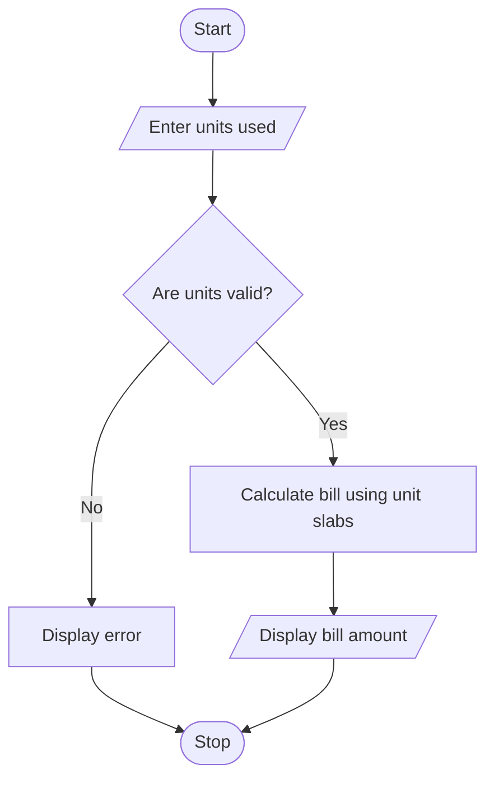

# Electricity Bill Calculator — Simple Flowchart

```mermaid
flowchart TD
 A([Start]) --> B[/Enter units used/]
 B --> C{Are units valid?}
 C -- No --> D[Display error]
 C -- Yes --> E[Calculate bill using unit slabs]
 E --> F[/Display bill amount/]
 D --> G([Stop])
 F --> G
```
