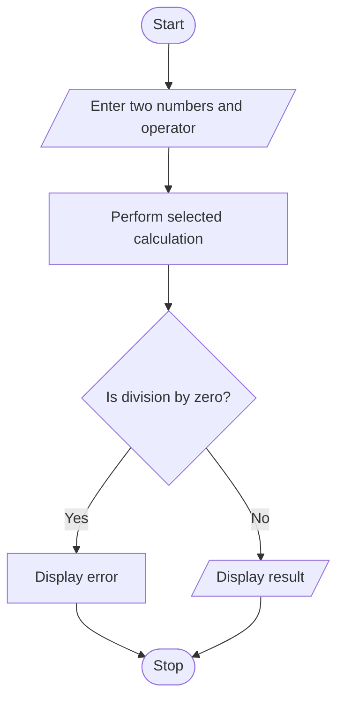

# Simple Calculator — Simple Flowchart

```mermaid
flowchart TD
 A([Start]) --> B[/Enter two numbers and operator/]
 B --> C[Perform selected calculation]
 C --> D{Is division by zero?}
 D -- Yes --> E[Display error]
 D -- No --> F[/Display result/]
 E --> G([Stop])
 F --> G
```
