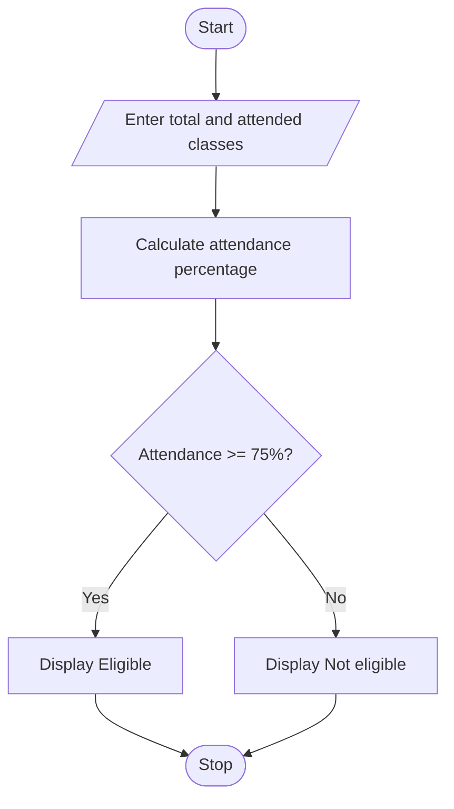

# Attendance Checker — Simple Flowchart

```mermaid
flowchart TD
 A([Start]) --> B[/Enter total and attended classes/]
 B --> C[Calculate attendance percentage]
 C --> D{Attendance >= 75%?}
 D -- Yes --> E[Display Eligible]
 D -- No --> F[Display Not eligible]
 E --> G([Stop])
 F --> G
```
