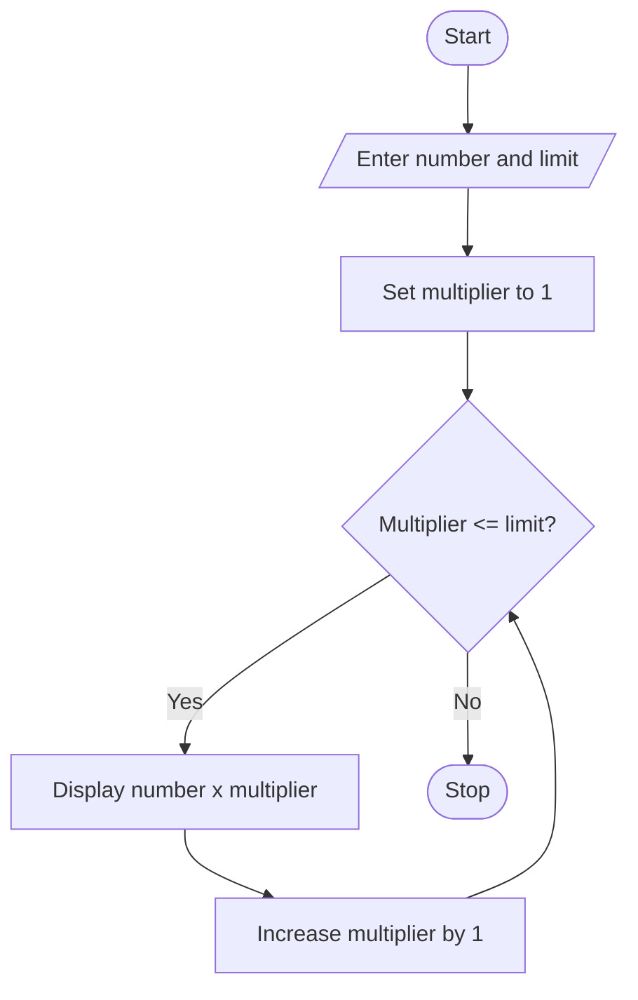

# Multiplication Table — Simple Flowchart

```mermaid
flowchart TD
 A([Start]) --> B[/Enter number and limit/]
 B --> C[Set multiplier to 1]
 C --> D{Multiplier <= limit?}
 D -- Yes --> E[Display number x multiplier]
 E --> F[Increase multiplier by 1]
 F --> D
 D -- No --> G([Stop])
```
