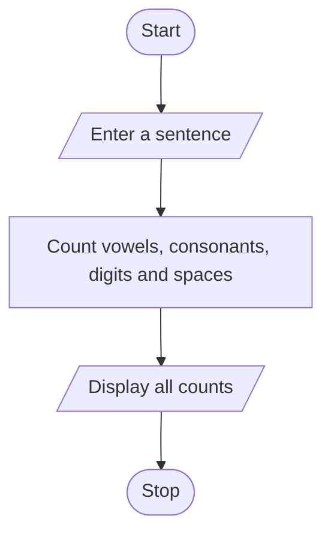

# String Analyzer — Simple Flowchart

```mermaid
flowchart TD
 A([Start]) --> B[/Enter a sentence/]
 B --> C[Count vowels, consonants, digits and spaces]
 C --> D[/Display all counts/]
 D --> E([Stop])
```
