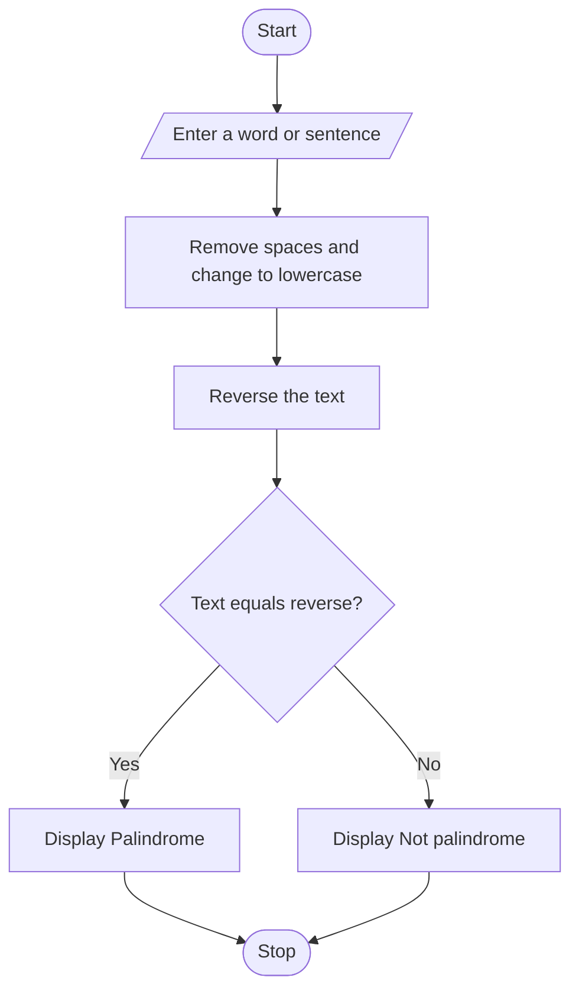

# Palindrome Checker — Simple Flowchart

```mermaid
flowchart TD
 A([Start]) --> B[/Enter a word or sentence/]
 B --> C[Remove spaces and change to lowercase]
 C --> D[Reverse the text]
 D --> E{Text equals reverse?}
 E -- Yes --> F[Display Palindrome]
 E -- No --> G[Display Not palindrome]
 F --> H([Stop])
 G --> H
```
