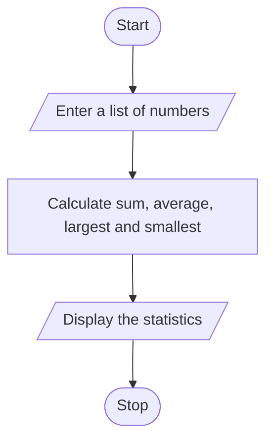

# List Statistics — Simple Flowchart

```mermaid
flowchart TD
 A([Start]) --> B[/Enter a list of numbers/]
 B --> C[Calculate sum, average, largest and smallest]
 C --> D[/Display the statistics/]
 D --> E([Stop])
```
