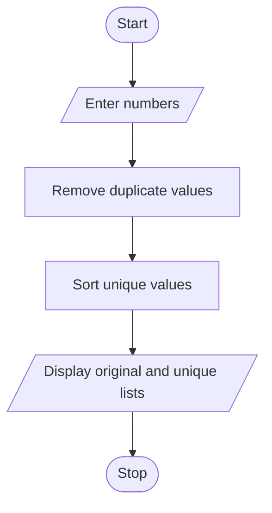

# Duplicate Remover — Simple Flowchart

```mermaid
flowchart TD
 A([Start]) --> B[/Enter numbers/]
 B --> C[Remove duplicate values]
 C --> D[Sort unique values]
 D --> E[/Display original and unique lists/]
 E --> F([Stop])
```
