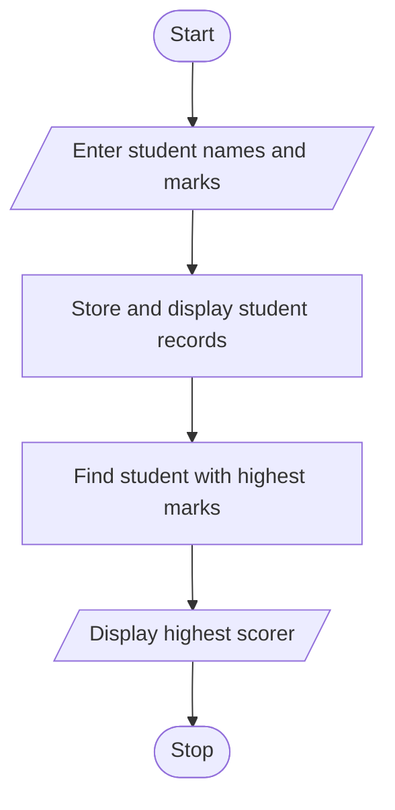

# Student Records — Simple Flowchart

```mermaid
flowchart TD
 A([Start]) --> B[/Enter student names and marks/]
 B --> C[Store and display student records]
 C --> D[Find student with highest marks]
 D --> E[/Display highest scorer/]
 E --> F([Stop])
```
